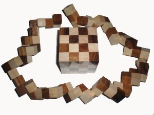

# NxNSolver
NxN Snake Cube Puzzle Solver

This project was created to solve a puzzle which has been sitting on my desk for more than four years. My friend bet me that I couldn't write software to solve it.

The NxN solver implementation in this project is able to solve any sized cube snake puzzle, and has been verified to output correct results for both the 3x3 and 4x4 puzzles I own. It is able to find a solution to a 4x4 puzzle in 11 seconds, attempting 46 million positions in a depth first search. 